# <span style="color:#0B57D0;">Java Spring Boot — HTTP, REST, IoC, DI & First REST API</span>

> **Environment:** Java 21 + Spring Boot + Spring Tools for Eclipse (STS) + Maven + Postman  
> **Goal:** Understand HTTP, REST principles, Spring Boot project structure, IoC, DI, key annotations, and build the first working `GET /hello` API.

---

## <span style="color:#6A1B9A;">1. What We Are Going to Build</span>

We will start with a simple REST API:

```text
GET http://localhost:8080/hello
```

Expected response:

```text
Hello from Spring Boot
```

### Request Flow

```mermaid
flowchart TD
    A[Client / Browser / Postman] -->|HTTP GET /hello| B[Spring Boot Application]
    B --> C[@RestController]
    C --> D[@GetMapping /hello]
    D --> E[Java Method Executes]
    E --> F[Response: Hello from Spring Boot]
```

Later, the same architecture grows into:

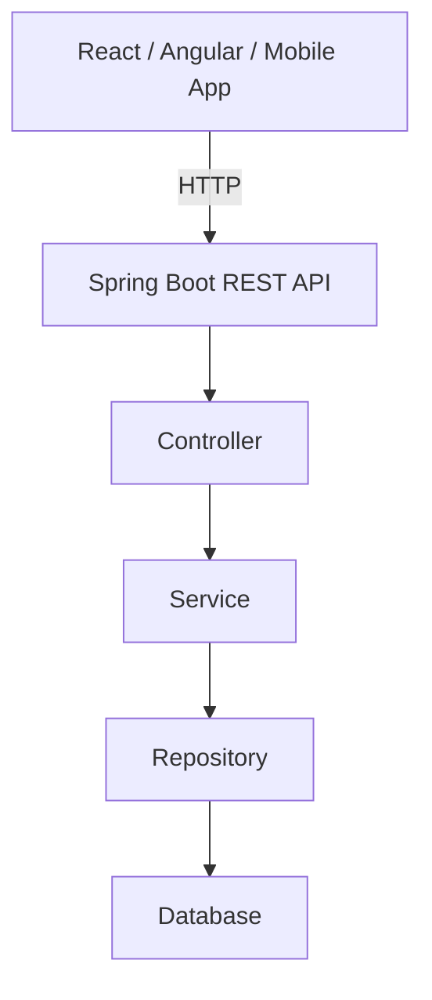

---

# <span style="color:#D93025;">2. What is HTTP?</span>

## Definition

**HTTP** stands for **HyperText Transfer Protocol**.

It is the communication protocol used by clients and servers to exchange information over the web.

Example:

```text
https://example.com/employees
```

When the browser accesses this URL, it sends an **HTTP Request**.  
The server processes the request and sends an **HTTP Response**.

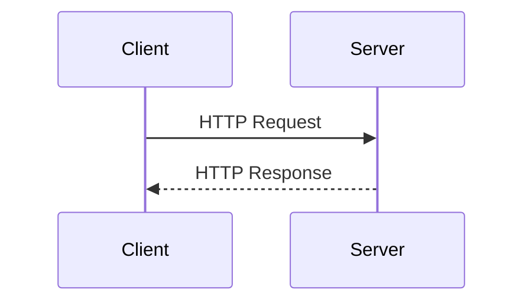

### Common HTTP Clients

- Browser
- Postman
- React application
- Angular application
- Mobile application
- Another backend application
- `curl`

### Common HTTP Servers

- Spring Boot
- .NET
- Node.js
- Python Flask
- Django
- Express
- Go

HTTP allows applications written in different technologies to communicate.

---

# <span style="color:#188038;">3. Real-World HTTP Example</span>

Consider an employee management portal:

```text
Employee Management

[View Employees]
[Add Employee]
[Update Employee]
[Delete Employee]
```

Each action maps naturally to an HTTP request:

| User Action | HTTP Request |
|---|---|
| View Employees | `GET /employees` |
| Add Employee | `POST /employees` |
| Update Employee | `PUT /employees/101` |
| Delete Employee | `DELETE /employees/101` |

---

# <span style="color:#F29900;">4. Important HTTP Methods</span>

| HTTP Method | Purpose | Example |
|---|---|---|
| `GET` | Retrieve data | Get employees |
| `POST` | Create new data | Add employee |
| `PUT` | Replace/update data | Update employee |
| `PATCH` | Partially update data | Change salary only |
| `DELETE` | Delete data | Delete employee |

---

## <span style="color:#0B57D0;">GET</span>

Used to retrieve information.

```http
GET /employees
```

Meaning:

> Give me all employees.

Example response:

```json
[
  {
    "id": 101,
    "name": "John"
  },
  {
    "id": 102,
    "name": "Mary"
  }
]
```

Specific employee:

```http
GET /employees/101
```

Response:

```json
{
  "id": 101,
  "name": "John"
}
```

---

## <span style="color:#188038;">POST</span>

Used to create a new resource.

```http
POST /employees
```

Request body:

```json
{
  "name": "David",
  "department": "IT"
}
```

Possible response:

```json
{
  "id": 103,
  "name": "David",
  "department": "IT"
}
```

---

## <span style="color:#6A1B9A;">PUT</span>

Used to replace or fully update a resource.

```http
PUT /employees/103
```

Request body:

```json
{
  "name": "David Kumar",
  "department": "Finance"
}
```

---

## <span style="color:#A142F4;">PATCH</span>

Used for partial updates.

Existing employee:

```json
{
  "id": 103,
  "name": "David",
  "department": "IT",
  "salary": 50000
}
```

Request:

```http
PATCH /employees/103
```

```json
{
  "salary": 55000
}
```

Only the salary changes.

---

## <span style="color:#D93025;">DELETE</span>

Used to remove a resource.

```http
DELETE /employees/103
```

Meaning:

> Delete employee 103.

---

# <span style="color:#0B57D0;">5. HTTP Request Structure</span>

An HTTP request generally contains:

```text
HTTP Request
│
├── Method
├── URL
├── Headers
└── Body
```

Example:

```http
POST /employees HTTP/1.1
Host: localhost:8080
Content-Type: application/json
Authorization: Bearer xyz

{
  "name": "Ravi",
  "department": "IT"
}
```

---

# <span style="color:#188038;">6. HTTP Response</span>

A response usually contains:

```text
HTTP Response
│
├── Status Code
├── Headers
└── Body
```

Example:

```http
HTTP/1.1 201 Created
Content-Type: application/json

{
  "id": 101,
  "name": "Ravi"
}
```

---

# <span style="color:#D93025;">7. Important HTTP Status Codes</span>

## Success

| Code | Meaning |
|---|---|
| `200 OK` | Request succeeded |
| `201 Created` | New resource created |
| `204 No Content` | Request succeeded, no body returned |

## Client Errors

| Code | Meaning |
|---|---|
| `400 Bad Request` | Invalid request |
| `401 Unauthorized` | Authentication missing/invalid |
| `403 Forbidden` | Authenticated but not allowed |
| `404 Not Found` | Resource does not exist |

## Server Errors

| Code | Meaning |
|---|---|
| `500 Internal Server Error` | Server-side failure |

Examples of 500 errors:

- Database connection issue
- `NullPointerException`
- Unhandled exception

---

# <span style="color:#6A1B9A;">8. What is REST?</span>

**REST** stands for:

**Representational State Transfer**

REST is an **architectural style** for designing web APIs.

It is not:

- a programming language
- a product
- a framework
- a protocol

REST commonly uses HTTP methods and resource-based URLs.

---

# <span style="color:#0B57D0;">9. What is a REST API?</span>

A REST API exposes resources through URLs and uses HTTP methods to operate on them.

### Less REST-like

```text
/getAllEmployees
/createNewEmployee
/deleteEmployee
/updateEmployee
```

### Better REST-style

```text
GET    /employees
POST   /employees
GET    /employees/101
PUT    /employees/101
DELETE /employees/101
```

Key idea:

```text
URL = Resource
HTTP Method = Action
```

---

# <span style="color:#188038;">10. REST Resource Concept</span>

Resources may be:

```text
Employees
Departments
Customers
Orders
Products
Invoices
```

REST-style URLs:

```text
/employees
/departments
/customers
/orders
/products
/invoices
```

Specific resources:

```text
/employees/101
/orders/5001
/products/25
```

---

# <span style="color:#F29900;">11. REST Principles</span>

## Client-Server Separation

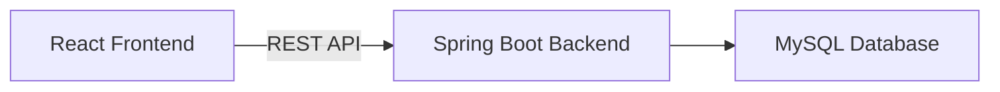

The frontend does not need to know how Java, JPA, or SQL are implemented.

The backend does not need to know whether the client is React, Angular, Flutter, Android, iOS, or another API.

---

## Statelessness

Each request should contain enough information to be processed independently.

```http
GET /employees/101
Authorization: Bearer abcxyz
```

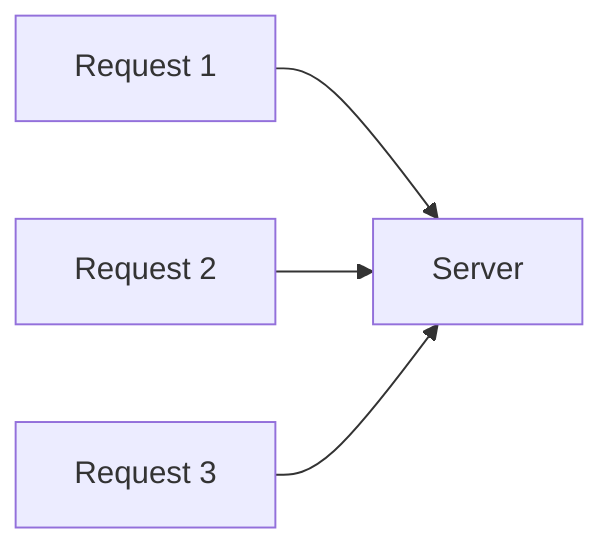

Each request is understandable independently.

---

## Resource-Based URLs

Prefer nouns:

```text
/employees
/orders
/customers
```

Avoid:

```text
/getEmployees
/deleteEmployee
/createCustomer
```

The HTTP method already expresses the action.

---

# <span style="color:#0B57D0;">12. Why Companies Use REST</span>

REST is popular because it provides a simple and interoperable way for systems to communicate.

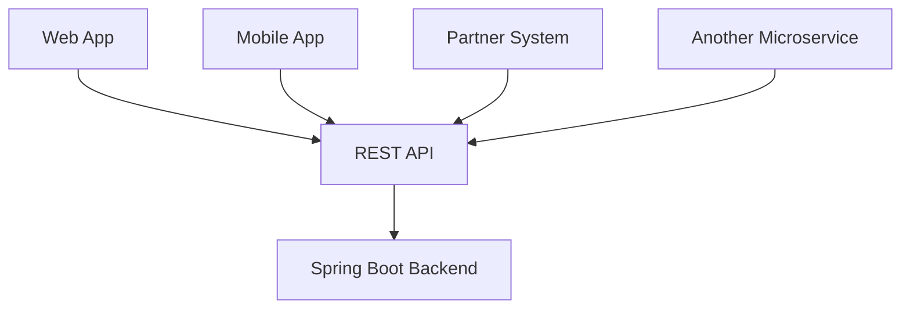

Benefits include:

- standard HTTP methods
- clear resource URLs
- scalable architecture
- loose coupling
- easy integration
- support for caching
- easy testing

---

# <span style="color:#188038;">13. What is Spring?</span>

Spring is a Java framework used to simplify application development.

It provides support for:

- Dependency Injection
- Web applications
- REST APIs
- Database access
- Transactions
- Security
- Microservices
- Messaging
- Testing
- Configuration

The foundation of Spring is its **IoC container**.

---

# <span style="color:#6A1B9A;">14. What is Spring Boot?</span>

Spring Boot builds on Spring Framework and makes Spring applications easier to configure and run.

It provides:

- auto configuration
- starter dependencies
- embedded web server
- production-ready defaults
- simplified project setup

Conceptually:

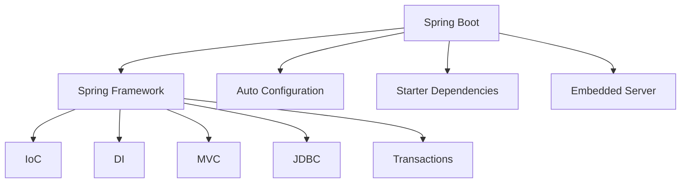

Spring Boot does not replace Spring.  
It makes Spring easier to configure and launch.

---

# <span style="color:#D93025;">15. Development Setup</span>

Recommended stack:

```text
JDK 21
Spring Tools for Eclipse
Maven
Spring Boot
Postman
```

---

## Install Java

Install **JDK 21**.

Verify:

```bash
java -version
```

and:

```bash
javac -version
```

Expected:

```text
java version "21..."
javac 21...
```

---

## Configure JAVA_HOME on Windows

Example:

```text
JAVA_HOME=C:\Program Files\Java\jdk-21
```

Add this to `PATH`:

```text
%JAVA_HOME%\bin
```

Check:

```cmd
echo %JAVA_HOME%
```

---

# <span style="color:#0B57D0;">16. Install Spring Tools / STS</span>

Use **Spring Tools for Eclipse**.

When opening STS, choose a workspace, for example:

```text
C:\SpringWorkspace
```

or:

```text
C:\Training\SpringWorkspace
```

---

# <span style="color:#188038;">17. Create the First Spring Boot Project</span>

In Spring Tools:

```text
File
  ↓
New
  ↓
Spring Starter Project
```

Use:

```text
Name:       employee-api
Type:       Maven
Packaging:  Jar
Java:       21
Group:      com.training
Artifact:   employee-api
Package:    com.training.employeeapi
```

Dependency:

```text
Spring Web
```

---

# <span style="color:#F29900;">18. What is Group?</span>

Example:

```text
com.training
```

It usually represents your organization or namespace.

Examples:

```text
com.companyname
com.bankname
org.organization
```

---

# <span style="color:#6A1B9A;">19. What is Artifact?</span>

The artifact is the project/application name.

Example:

```text
employee-api
```

Maven coordinates:

```text
com.training:employee-api
```

---

# <span style="color:#0B57D0;">20. Spring Boot Project Structure</span>

```text
employee-api
│
├── src/main/java
│   └── com/training/employeeapi
│       └── EmployeeApiApplication.java
│
├── src/main/resources
│   ├── application.properties
│   ├── static
│   └── templates
│
├── src/test/java
│
├── pom.xml
│
├── mvnw
└── mvnw.cmd
```

---

## `src/main/java`

Contains production Java code.

Typical packages:

```text
controller
service
repository
model
dto
configuration
```

---

## `src/main/resources`

Contains configuration and resources:

```text
application.properties
application.yml
static files
templates
```

---

## `application.properties`

Example:

```properties
server.port=8080
```

Change the port:

```properties
server.port=9090
```

Now the app runs on:

```text
http://localhost:9090
```

---

## `src/test/java`

Contains:

- Unit tests
- Integration tests
- Controller tests
- Service tests
- Repository tests

---

## `pom.xml`

Maven configuration file.

It handles:

- dependencies
- plugins
- builds
- versions
- project metadata

Typical dependency:

```xml
<dependency>
    <groupId>org.springframework.boot</groupId>
    <artifactId>spring-boot-starter-web</artifactId>
</dependency>
```

---

# <span style="color:#188038;">21. What is Maven?</span>

Maven is a Java build and dependency management tool.

Without Maven, you might manually download many `.jar` files.

With Maven, you declare:

```xml
spring-boot-starter-web
```

and Maven resolves related dependencies.

---

# <span style="color:#D93025;">22. Main Spring Boot Class</span>

```java
package com.training.employeeapi;

import org.springframework.boot.SpringApplication;
import org.springframework.boot.autoconfigure.SpringBootApplication;

@SpringBootApplication
public class EmployeeApiApplication {

    public static void main(String[] args) {
        SpringApplication.run(EmployeeApiApplication.class, args);
    }
}
```

---

# <span style="color:#6A1B9A;">23. What Does `@SpringBootApplication` Do?</span>

Conceptually:

```text
@SpringBootApplication
        |
        +---- Configuration
        |
        +---- Auto Configuration
        |
        +---- Component Scanning
```

It helps Spring discover components such as:

```java
@RestController
@Controller
@Service
@Repository
@Component
```

---

# <span style="color:#0B57D0;">24. Recommended Package Structure</span>

```text
com.training.employeeapi
│
├── EmployeeApiApplication.java
├── controller
│   └── HelloController.java
├── service
│   └── EmployeeService.java
├── repository
│   └── EmployeeRepository.java
├── model
│   └── Employee.java
└── dto
    └── EmployeeRequest.java
```

---

# <span style="color:#188038;">25. What is IoC?</span>

**IoC** stands for **Inversion of Control**.

Normal Java:

```java
EmployeeService service = new EmployeeService();
```

Your class controls object creation.

With Spring:

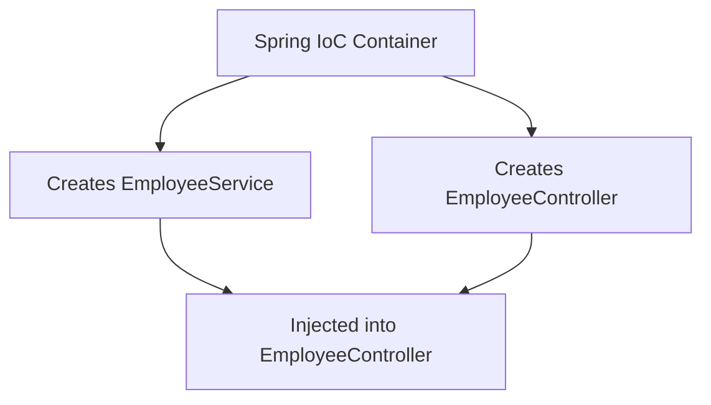

Instead of your code creating objects, Spring creates and manages them.

That is **Inversion of Control**.

---

# <span style="color:#F29900;">26. Spring IoC Container</span>

The IoC container manages:

- object creation
- object lifecycle
- dependencies
- configuration
- bean relationships

```text
Spring IoC Container

┌─────────────────────┐
│ EmployeeController  │
├─────────────────────┤
│ EmployeeService     │
├─────────────────────┤
│ EmployeeRepository  │
└─────────────────────┘
```

Objects managed by Spring are called **Beans**.

---

# <span style="color:#6A1B9A;">27. What is a Spring Bean?</span>

Example:

```java
@Service
public class EmployeeService {
}
```

Spring detects the class, creates an object, and manages it.

That managed object is a **Spring Bean**.

---

# <span style="color:#0B57D0;">28. What is Dependency Injection?</span>

Suppose:

```text
EmployeeController
```

needs:

```text
EmployeeService
```

Without DI:

```java
public class EmployeeController {

    private EmployeeService employeeService =
            new EmployeeService();
}
```

This creates tight coupling.

With DI:

```java
@RestController
public class EmployeeController {

    private final EmployeeService employeeService;

    public EmployeeController(EmployeeService employeeService) {
        this.employeeService = employeeService;
    }
}
```

No:

```java
new EmployeeService();
```

Spring supplies the dependency.

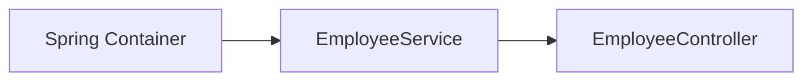

---

# <span style="color:#188038;">29. Why Dependency Injection is Helpful</span>

## Loose Coupling

Without DI:

```text
Controller → creates Service
```

With DI:

```text
Controller → receives Service
```

---

## Easier Testing

Production:

```text
RealPaymentService
```

Testing:

```text
MockPaymentService
```

DI makes replacement easy.

---

## Easier Maintenance

Today:

```text
EmployeeService → MySQL Repository
```

Tomorrow:

```text
EmployeeService → PostgreSQL Repository
```

or:

```text
EmployeeService → External HR API
```

Loose coupling makes changes easier.

---

# <span style="color:#D93025;">30. IoC vs DI</span>

```text
IoC = Broader principle
DI  = Mechanism used to implement IoC
```

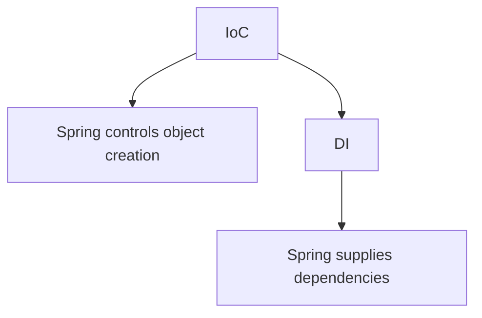

---

# <span style="color:#6A1B9A;">31. Real-World DI Example</span>

Interface:

```java
public interface PaymentService {
    void pay();
}
```

Implementation:

```java
@Service
public class StripePaymentService implements PaymentService {

    @Override
    public void pay() {
        System.out.println("Payment through Stripe");
    }
}
```

Service:

```java
@Service
public class OrderService {

    private final PaymentService paymentService;

    public OrderService(PaymentService paymentService) {
        this.paymentService = paymentService;
    }
}
```

Later, the implementation can be changed to:

```text
RazorpayPaymentService
PayPalPaymentService
MockPaymentService
```

---

# <span style="color:#0B57D0;">32. Important Spring Annotations</span>

| Annotation | Purpose |
|---|---|
| `@SpringBootApplication` | Main application configuration |
| `@RestController` | REST controller |
| `@GetMapping` | HTTP GET endpoint |
| `@PostMapping` | HTTP POST endpoint |
| `@PutMapping` | HTTP PUT endpoint |
| `@PatchMapping` | HTTP PATCH endpoint |
| `@DeleteMapping` | HTTP DELETE endpoint |
| `@Service` | Business/service component |
| `@Repository` | Data access component |
| `@Component` | Generic Spring-managed component |

---

# <span style="color:#188038;">33. `@RestController`</span>

Example:

```java
@RestController
public class HelloController {
}
```

It tells Spring:

> This class handles web requests and returns response data.

Flow:

```mermaid
flowchart LR
    A[HTTP Request] --> B[@RestController]
    B --> C[Java Method]
    C --> D[HTTP Response]
```

---

# <span style="color:#F29900;">34. `@GetMapping`</span>

Example:

```java
@GetMapping("/hello")
```

Meaning:

> When an HTTP GET request comes to `/hello`, execute this method.

```java
@GetMapping("/hello")
public String hello() {
    return "Hello";
}
```

---

# <span style="color:#6A1B9A;">35. Create the First Controller in STS</span>

In Spring Tools:

```text
src/main/java
   ↓
com.training.employeeapi
   ↓
New → Package
```

Create:

```text
com.training.employeeapi.controller
```

Then create:

```text
HelloController
```

---

# <span style="color:#0B57D0;">36. Complete `HelloController`</span>

```java
package com.training.employeeapi.controller;

import org.springframework.web.bind.annotation.GetMapping;
import org.springframework.web.bind.annotation.RestController;

@RestController
public class HelloController {

    @GetMapping("/hello")
    public String hello() {
        return "Hello from Spring Boot";
    }
}
```

---

# <span style="color:#188038;">37. Understand Every Line</span>

```java
package com.training.employeeapi.controller;
```

Defines the package.

```java
import org.springframework.web.bind.annotation.GetMapping;
```

Imports `@GetMapping`.

```java
import org.springframework.web.bind.annotation.RestController;
```

Imports `@RestController`.

```java
@RestController
```

Marks the class as a REST controller.

```java
@GetMapping("/hello")
```

Maps GET `/hello`.

```java
return "Hello from Spring Boot";
```

Becomes the HTTP response body.

---

# <span style="color:#D93025;">38. Run the Application in STS</span>

Right-click the project:

```text
Run As
→ Spring Boot App
```

By default:

```text
Port: 8080
```

Test in browser:

```text
http://localhost:8080/hello
```

Expected response:

```text
Hello from Spring Boot
```

---

# <span style="color:#6A1B9A;">39. What Happens Internally?</span>

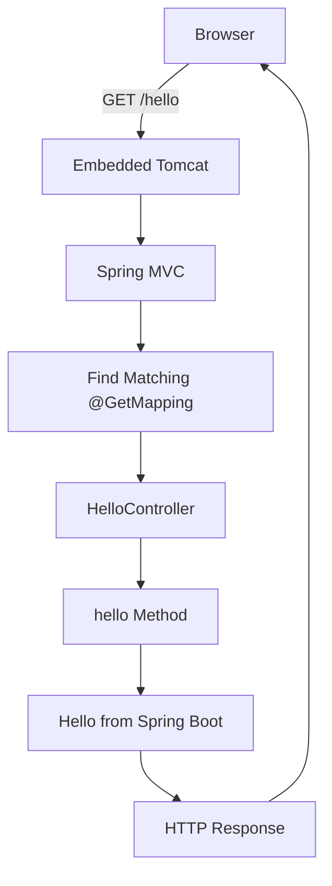

---

# <span style="color:#0B57D0;">40. IoC in the First Example</span>

You never write:

```java
HelloController controller = new HelloController();
```

Spring creates it.

```text
@RestController
       ↓
Spring detects class
       ↓
Spring creates object
       ↓
Object becomes Spring Bean
       ↓
Spring manages it
```

---

# <span style="color:#188038;">41. Demonstrate Dependency Injection Properly</span>

Create:

```text
com.training.employeeapi.service
```

Then:

```java
package com.training.employeeapi.service;

import org.springframework.stereotype.Service;

@Service
public class HelloService {

    public String getMessage() {
        return "Hello from Spring Boot Service";
    }
}
```

---

# <span style="color:#F29900;">42. What Does `@Service` Mean?</span>

`@Service` tells Spring that the class belongs to the service layer.

```text
@Service
    ↓
Spring discovers class
    ↓
Spring creates bean
    ↓
Spring manages bean
```

---

# <span style="color:#6A1B9A;">43. Inject `HelloService` into the Controller</span>

```java
package com.training.employeeapi.controller;

import org.springframework.web.bind.annotation.GetMapping;
import org.springframework.web.bind.annotation.RestController;

import com.training.employeeapi.service.HelloService;

@RestController
public class HelloController {

    private final HelloService helloService;

    public HelloController(HelloService helloService) {
        this.helloService = helloService;
    }

    @GetMapping("/hello")
    public String hello() {
        return helloService.getMessage();
    }
}
```

Notice:

```java
new HelloService();
```

is not used.

---

# <span style="color:#0B57D0;">44. Dependency Injection Flow</span>

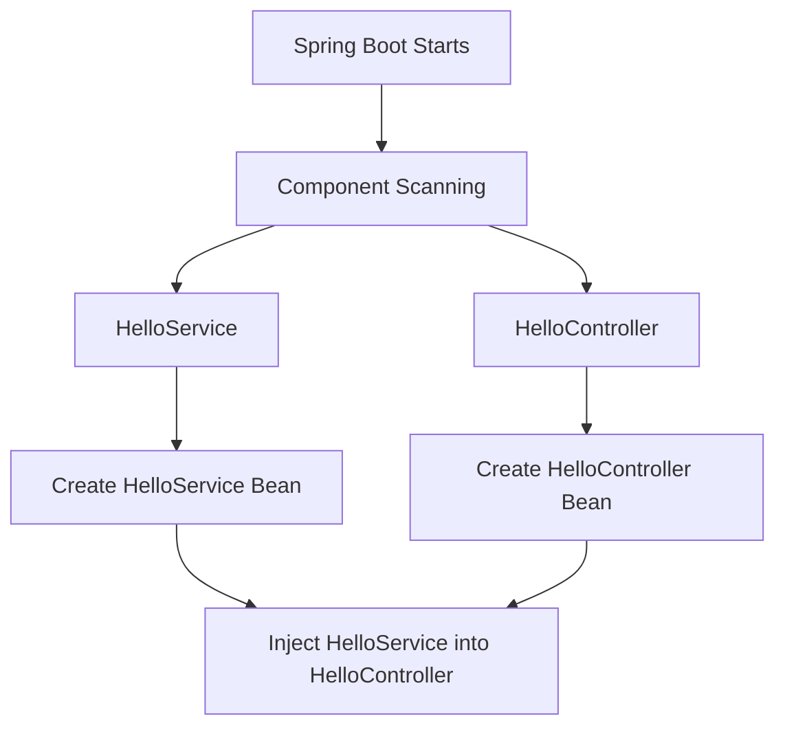

Request flow:


---

# <span style="color:#188038;">45. Do We Need `@Autowired`?</span>

Older code may use:

```java
@Autowired
private HelloService helloService;
```

or:

```java
@Autowired
public HelloController(HelloService helloService) {
    this.helloService = helloService;
}
```

For a class with a single constructor, constructor injection works without explicitly writing `@Autowired`.

Preferred:

```java
public HelloController(HelloService helloService) {
    this.helloService = helloService;
}
```

---

# <span style="color:#D93025;">46. Avoid Field Injection for New Code</span>

Avoid:

```java
@Autowired
private EmployeeService employeeService;
```

Prefer:

```java
private final EmployeeService employeeService;

public EmployeeController(EmployeeService employeeService) {
    this.employeeService = employeeService;
}
```

Benefits:

- dependency is explicit
- field can be `final`
- easier testing
- better maintainability
- object cannot be created without required dependency

---

# <span style="color:#6A1B9A;">47. Add a Realistic GET Endpoint</span>

```java
package com.training.employeeapi.controller;

import java.util.List;

import org.springframework.web.bind.annotation.GetMapping;
import org.springframework.web.bind.annotation.RestController;

@RestController
public class EmployeeController {

    @GetMapping("/employees")
    public List<String> getEmployees() {

        return List.of(
                "Ravi",
                "Priya",
                "David"
        );
    }
}
```

Run:

```text
http://localhost:8080/employees
```

Response:

```json
[
  "Ravi",
  "Priya",
  "David"
]
```

---

# <span style="color:#0B57D0;">48. Create an Employee Model</span>

```java
package com.training.employeeapi.model;

public class Employee {

    private int id;
    private String name;
    private String department;

    public Employee(int id, String name, String department) {
        this.id = id;
        this.name = name;
        this.department = department;
    }

    public int getId() {
        return id;
    }

    public String getName() {
        return name;
    }

    public String getDepartment() {
        return department;
    }
}
```

---

# <span style="color:#188038;">49. Controller Returning Java Objects</span>

```java
package com.training.employeeapi.controller;

import java.util.List;

import org.springframework.web.bind.annotation.GetMapping;
import org.springframework.web.bind.annotation.RestController;

import com.training.employeeapi.model.Employee;

@RestController
public class EmployeeController {

    @GetMapping("/employees")
    public List<Employee> getEmployees() {

        return List.of(
            new Employee(101, "Ravi", "IT"),
            new Employee(102, "Priya", "Finance")
        );
    }
}
```

Response:

```json
[
  {
    "id": 101,
    "name": "Ravi",
    "department": "IT"
  },
  {
    "id": 102,
    "name": "Priya",
    "department": "Finance"
  }
]
```

---

# <span style="color:#F29900;">50. Java Object to JSON Conversion</span>

You do not manually convert Java objects to JSON.

Conceptually:

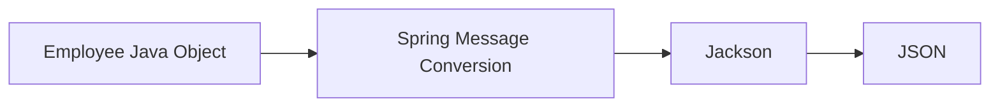

---

# <span style="color:#6A1B9A;">51. Recommended Enterprise Architecture</span>

Avoid:

```text
Controller
   ↓
Database directly
```

Prefer:

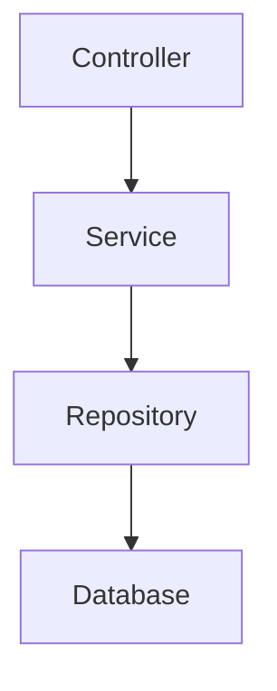

---

# <span style="color:#0B57D0;">52. Controller Layer</span>

Responsible for:

- reading URL
- reading request body
- reading query parameters
- reading path variables
- returning HTTP responses

Example:

```java
@RestController
public class EmployeeController {
}
```

---

# <span style="color:#188038;">53. Service Layer</span>

Responsible for business logic.

Examples:

- calculate salary
- check eligibility
- calculate tax
- apply discount
- validate order
- determine approval

Example:

```java
@Service
public class EmployeeService {
}
```

---

# <span style="color:#D93025;">54. Repository Layer</span>

Responsible for data access.

Examples:

- save employee
- find employee
- delete employee
- update employee

Later you will use:

```java
@Repository
```

and Spring Data JPA repositories.

---

# <span style="color:#6A1B9A;">55. Real-World Business Example</span>

Bad:

```java
@PostMapping("/loans")
public Loan apply() {

    // validation
    // credit scoring
    // interest calculation
    // database query
    // save database
    // send email
    // audit
}
```

Better:

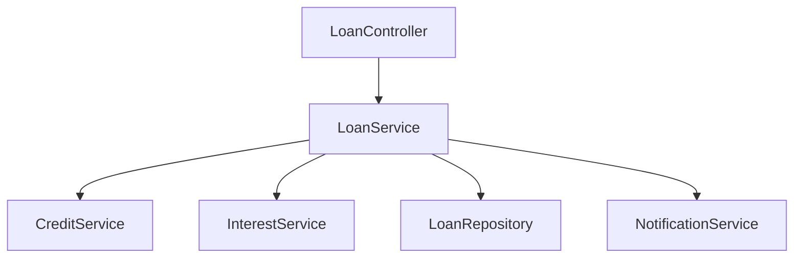

---

# <span style="color:#0B57D0;">56. Full Real-World Request Flow</span>

Example:

```http
GET /employees/101
```

Flow:

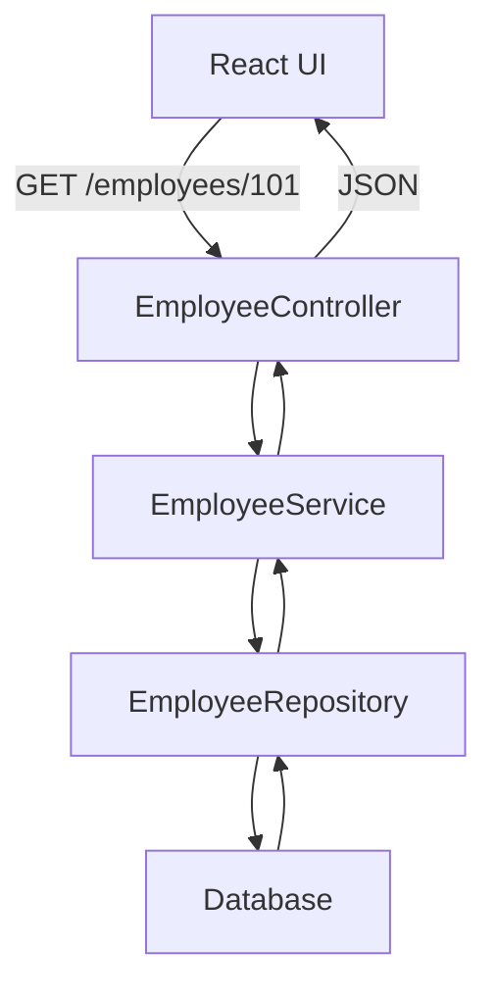

---

# <span style="color:#188038;">57. Practical Mini-Project Structure</span>

```text
employee-api
│
├── pom.xml
│
└── src
    │
    ├── main
    │   │
    │   ├── java
    │   │   └── com
    │   │       └── training
    │   │           └── employeeapi
    │   │
    │   │               ├── EmployeeApiApplication.java
    │   │               ├── controller
    │   │               │   ├── HelloController.java
    │   │               │   └── EmployeeController.java
    │   │               ├── service
    │   │               │   └── HelloService.java
    │   │               └── model
    │   │                   └── Employee.java
    │   │
    │   └── resources
    │       └── application.properties
    │
    └── test
        └── java
```

---

# <span style="color:#F29900;">58. Complete Request-Response Lifecycle</span>

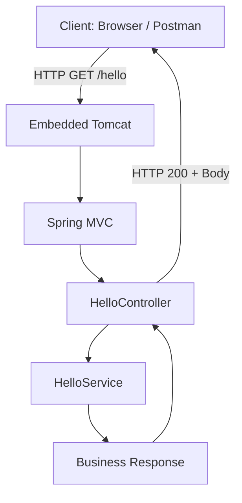

---

# <span style="color:#6A1B9A;">59. Where IoC and DI Happen</span>

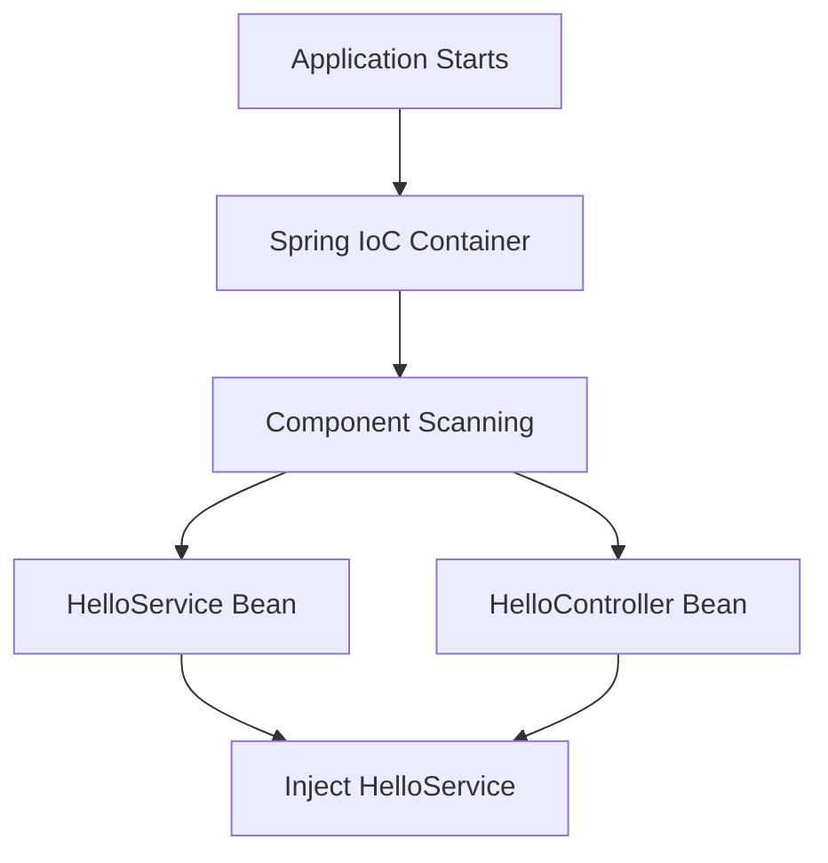

---

# <span style="color:#0B57D0;">60. Common Beginner Mistake: Package Placement</span>

Recommended:

```text
com.training.employeeapi
    |
    ├── controller
    ├── service
    ├── repository
    └── model
```

Keep the main application class at the top package:

```text
com.training.employeeapi
```

This helps component scanning discover your classes.

---

# <span style="color:#188038;">61. Common Issue: Port Already in Use</span>

Error:

```text
Port 8080 was already in use
```

Option 1: Stop the process using port 8080.

Option 2: Change the port.

`application.properties`

```properties
server.port=8081
```

Then use:

```text
http://localhost:8081/hello
```

---

# <span style="color:#D93025;">62. Common Issue: 404</span>

If this gives 404:

```text
http://localhost:8080/hello
```

Check:

- Is the application running?
- Is `HelloController` inside the scanned package?
- Is `@RestController` present?
- Is `@GetMapping("/hello")` correct?
- Are you using the correct port?

---

# <span style="color:#6A1B9A;">63. Common Issue: Application Does Not Start</span>

Check:

- Java version
- Maven dependencies
- `pom.xml`
- console errors
- port conflicts
- package names

In STS:

```text
Right-click project
→ Maven
→ Update Project
```

---

# <span style="color:#0B57D0;">64. Test Using curl</span>

```bash
curl http://localhost:8080/hello
```

Response:

```text
Hello from Spring Boot Service
```

Employees:

```bash
curl http://localhost:8080/employees
```

---

# <span style="color:#188038;">65. Why Use Postman?</span>

Postman is useful for:

- GET
- POST
- PUT
- PATCH
- DELETE
- request headers
- authentication
- JSON request bodies
- checking status codes

For `/hello`, a browser is enough.

---

# <span style="color:#F29900;">66. Final Working Source Code</span>

## `EmployeeApiApplication.java`

```java
package com.training.employeeapi;

import org.springframework.boot.SpringApplication;
import org.springframework.boot.autoconfigure.SpringBootApplication;

@SpringBootApplication
public class EmployeeApiApplication {

    public static void main(String[] args) {
        SpringApplication.run(EmployeeApiApplication.class, args);
    }
}
```

---

## `HelloService.java`

```java
package com.training.employeeapi.service;

import org.springframework.stereotype.Service;

@Service
public class HelloService {

    public String getMessage() {
        return "Hello from Spring Boot Service";
    }
}
```

---

## `HelloController.java`

```java
package com.training.employeeapi.controller;

import org.springframework.web.bind.annotation.GetMapping;
import org.springframework.web.bind.annotation.RestController;

import com.training.employeeapi.service.HelloService;

@RestController
public class HelloController {

    private final HelloService helloService;

    public HelloController(HelloService helloService) {
        this.helloService = helloService;
    }

    @GetMapping("/hello")
    public String hello() {
        return helloService.getMessage();
    }
}
```

---

## `Employee.java`

```java
package com.training.employeeapi.model;

public class Employee {

    private int id;
    private String name;
    private String department;

    public Employee(int id, String name, String department) {
        this.id = id;
        this.name = name;
        this.department = department;
    }

    public int getId() {
        return id;
    }

    public String getName() {
        return name;
    }

    public String getDepartment() {
        return department;
    }
}
```

---

## `EmployeeController.java`

```java
package com.training.employeeapi.controller;

import java.util.List;

import org.springframework.web.bind.annotation.GetMapping;
import org.springframework.web.bind.annotation.RestController;

import com.training.employeeapi.model.Employee;

@RestController
public class EmployeeController {

    @GetMapping("/employees")
    public List<Employee> getEmployees() {

        return List.of(
            new Employee(101, "Ravi", "IT"),
            new Employee(102, "Priya", "Finance"),
            new Employee(103, "David", "HR")
        );
    }
}
```

---

# <span style="color:#6A1B9A;">67. Available Endpoints</span>

### Hello API

```text
GET http://localhost:8080/hello
```

Response:

```text
Hello from Spring Boot Service
```

### Employee API

```text
GET http://localhost:8080/employees
```

Response:

```json
[
  {
    "id": 101,
    "name": "Ravi",
    "department": "IT"
  },
  {
    "id": 102,
    "name": "Priya",
    "department": "Finance"
  },
  {
    "id": 103,
    "name": "David",
    "department": "HR"
  }
]
```

---

# <span style="color:#0B57D0;">68. Key Concepts Summary</span>

```text
HTTP
│
├── GET      → Read
├── POST     → Create
├── PUT      → Update / Replace
├── PATCH    → Partial Update
└── DELETE   → Delete


REST
│
├── Resource-oriented URLs
├── HTTP methods
├── Stateless interaction
└── Standard HTTP semantics


Spring Boot
│
├── Simplifies Spring setup
├── Auto configuration
├── Embedded server
└── Starter dependencies


IoC
│
└── Spring controls object creation


DI
│
└── Spring supplies dependencies


@RestController
│
└── Handles REST requests


@GetMapping
│
└── Handles HTTP GET


@Service
│
└── Business/service component
```

The most important relationship is:

```mermaid
flowchart TD
    A[IoC] --> B[Spring manages objects]
    B --> C[DI]
    C --> D[Spring connects objects]
    D --> E[REST Controller]
    E --> F[Service]
    F --> G[Repository]
    G --> H[Database]
```

---

# <span style="color:#188038;">69. Recommended Next Topics</span>

After completing this module, continue with:

1. `@RequestMapping`
2. `@PathVariable`
3. `@RequestParam`
4. `@PostMapping`
5. `@PutMapping`
6. `@DeleteMapping`
7. DTOs
8. Validation
9. Exception Handling
10. Spring Data JPA
11. Database Integration
12. Complete CRUD API
