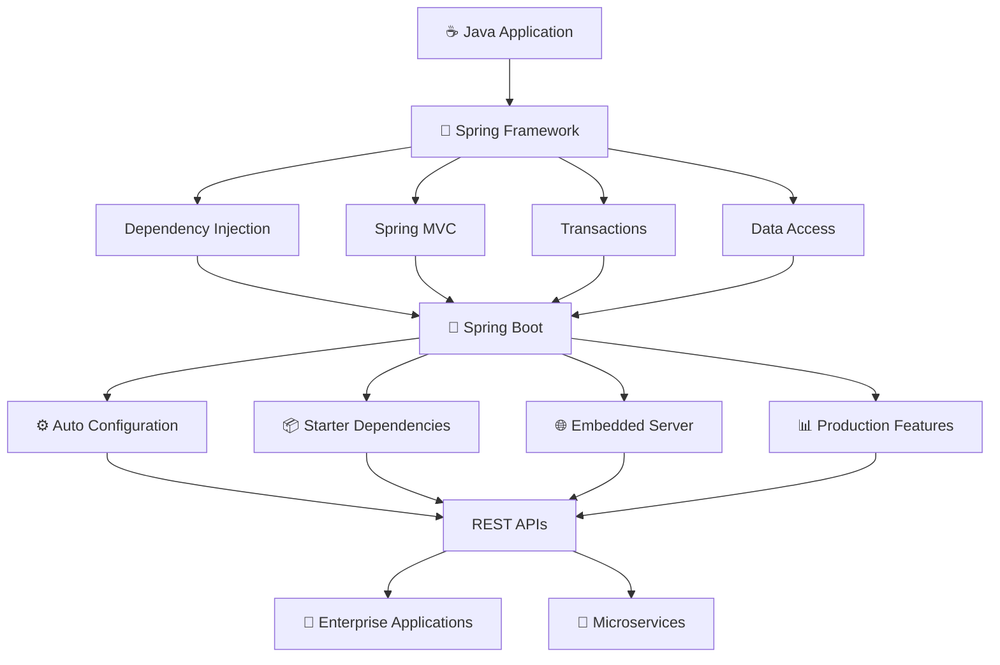
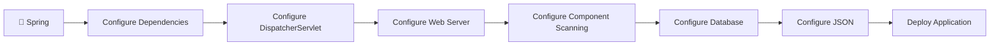
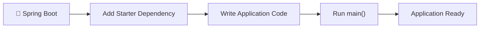
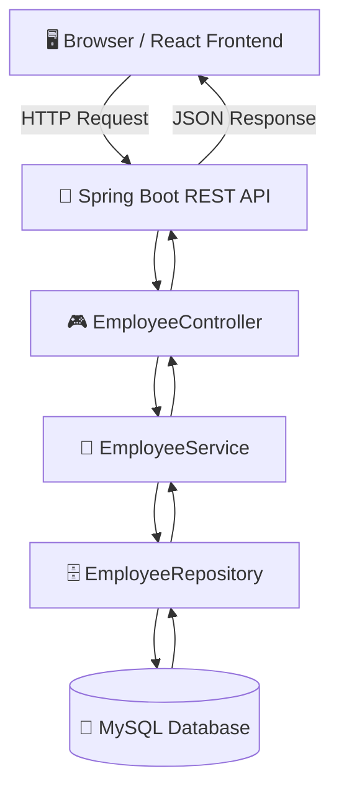
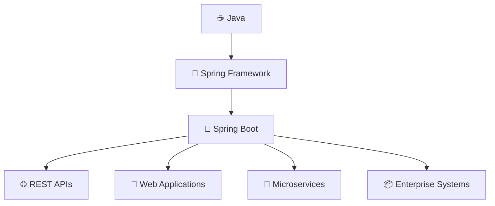
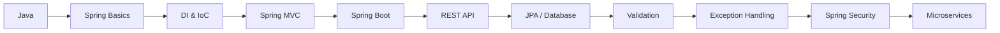

<div align="center">

# 🌈 Spring Framework vs Spring Boot

### A Professional, Beginner-Friendly Comparison Guide

<p>
  
  
  
</p>

</div>

---

## 🟣 1. Quick Answer

> **Spring Framework** provides the core building blocks for developing Java enterprise applications, while **Spring Boot** sits on top of Spring Framework and makes it faster and easier to configure, run, and deploy those applications.

---

## 🔵 2. Spring Framework vs Spring Boot — Comparison

| Feature | 🌱 Spring Framework | 🚀 Spring Boot |
|---|---|---|
| **Purpose** | Core framework for Java applications | Simplifies Spring application development |
| **Configuration** | More manual configuration | Mostly automatic configuration |
| **Server Setup** | Usually configure/deploy to a server | Embedded Tomcat, Jetty, or Undertow supported |
| **Dependencies** | Individual dependencies are managed manually | Starter dependencies simplify setup |
| **XML Configuration** | Historically common; Java configuration also supported | Mostly annotation/configuration based |
| **Application Startup** | More setup required | Can run directly using `main()` |
| **Production Features** | Usually configured separately | Actuator, health checks, metrics are easy to add |
| **Development Speed** | More configuration work | Faster project setup |
| **Learning Purpose** | Helps understand Spring internals | Easier starting point for modern applications |
| **Typical Modern Use** | Foundation underneath Spring apps | Common choice for modern REST APIs and microservices |

---

# 🟢 3. What is Spring Framework?

Spring Framework is the **foundation** of the Spring ecosystem.

It provides major capabilities such as:

```text
Spring Framework
│
├── Dependency Injection
├── Inversion of Control
├── Spring MVC
├── JDBC
├── Transaction Management
├── Security Integration
├── AOP
└── Data Access
```

### Example

```java
@Service
public class EmployeeService {

    public String getEmployee() {
        return "Ravi";
    }
}
```

Spring manages the `EmployeeService` object for us.

Without Spring, we might manually create the object:

```java
EmployeeService service = new EmployeeService();
```

With Spring, the container manages object creation, lifecycle, and dependency injection.

> 💡 This is one of Spring's most important ideas: **Dependency Injection (DI)** and **Inversion of Control (IoC)**.

---

# 🟠 4. What is Spring Boot?

Spring Boot is built **on top of Spring Framework**.

It reduces configuration and provides sensible defaults so developers can start applications quickly.

### Professional Architecture View



> ✅ Spring Boot is **not a replacement for Spring Framework**.  
> It is a faster and more convenient way to build Spring-based applications.

---

# 🔷 5. Spring Boot REST API Example

A Spring Boot application can be started with a normal Java `main()` method.

```java
@SpringBootApplication
public class EmployeeApplication {

    public static void main(String[] args) {
        SpringApplication.run(EmployeeApplication.class, args);
    }
}
```

Create a REST controller:

```java
@RestController
public class EmployeeController {

    @GetMapping("/hello")
    public String hello() {
        return "Hello Spring Boot";
    }
}
```

Run the application and access:

```text
http://localhost:8080/hello
```

Response:

```text
Hello Spring Boot
```

### Why is this convenient?

Spring Boot can automatically start an **embedded Tomcat server**, so you do not need to manually install and configure Tomcat for a basic application.

---

# 🟣 6. Why Was Spring Boot Introduced?

Traditional Spring applications could require more setup.

### Traditional Spring Style



### Spring Boot Style



### Main Benefit

Spring Boot reduces repetitive configuration and lets developers focus more on **business logic**.

---

# 🟢 7. What is Auto Configuration?

Auto Configuration is one of Spring Boot's biggest advantages.

Suppose you add:

```xml
<dependency>
    <groupId>org.springframework.boot</groupId>
    <artifactId>spring-boot-starter-web</artifactId>
</dependency>
```

Spring Boot detects that you are building a web application and automatically prepares many required components.

```text
spring-boot-starter-web
        │
        ├── Spring MVC
        ├── Embedded Tomcat
        ├── Jackson JSON Support
        ├── DispatcherServlet
        └── Common Web Infrastructure
```

> 🎯 Instead of configuring every component manually, Spring Boot uses sensible defaults.

---

# 🔵 8. What are Starter Dependencies?

Spring Boot provides predefined dependency groups called **Starters**.

### Web Application

```text
spring-boot-starter-web
```

Commonly used for:

- REST APIs
- Spring MVC
- Embedded Tomcat
- JSON processing

### Database Application

```text
spring-boot-starter-data-jpa
```

Used for:

- JPA
- Hibernate
- Repository-based database access

### Security

```text
spring-boot-starter-security
```

Used for:

- Authentication
- Authorization
- Application security

### Testing

```text
spring-boot-starter-test
```

Used for:

- Unit testing
- Integration testing
- Spring testing support

---

# 🟠 9. Real-World Example — Employee Management System

Consider an Employee Management application.



Typical APIs:

```http
GET    /employees
GET    /employees/101
POST   /employees
PUT    /employees/101
DELETE /employees/101
```

### What Spring Framework Provides

```text
Dependency Injection
Spring MVC
Transactions
Data Access
Validation
Security Integration
```

### What Spring Boot Adds

```text
Auto Configuration
Starter Dependencies
Embedded Server
Simplified Application Startup
Production Monitoring Features
```

---

# 🟡 10. Simple Real-Life Analogy

Imagine you want to build a house.

## 🌱 Spring Framework

Spring Framework gives you:

```text
Bricks
Cement
Steel
Wood
Electrical Materials
Plumbing Materials
```

You have powerful building materials, but you need to configure and assemble many parts.

## 🚀 Spring Boot

Spring Boot gives you:

```text
Spring Materials
      +
Predefined Structure
      +
Ready Configuration
      +
Useful Defaults
      +
Built-in Facilities
```

You are still using Spring underneath, but development becomes faster.

---

# 🔴 11. Important Misunderstanding

A common mistake is thinking:

```text
Spring Framework  VS  Spring Boot
```

as though they are competing technologies.

They are not.

The relationship is:



> **Spring Boot internally uses Spring Framework.**

---

# 🟣 12. Easy Sentence to Remember

> ### 🌟 Spring Framework provides the features.  
> ### 🚀 Spring Boot makes those features easier to configure, run, and deploy.

---

# 🧭 13. Recommended Learning Path



A practical learning order is:

1. **Spring Basics**
2. **Dependency Injection and IoC**
3. **Spring MVC**
4. **Spring Boot**
5. **REST API Development**
6. **JPA and Database Integration**
7. **Validation**
8. **Global Exception Handling**
9. **Spring Security**
10. **Microservices**

---

<div align="center">

## 🎯 Final Summary

| Spring Framework | Spring Boot |
|---|---|
| Provides the core Spring features | Simplifies the use of Spring |
| More configuration responsibility | Convention and auto configuration |
| Foundation technology | Productivity layer on top of Spring |
| Flexible and powerful | Fast and developer-friendly |

### **Spring Framework = Foundation**
### **Spring Boot = Spring Framework + Convenience + Automation**

</div>
